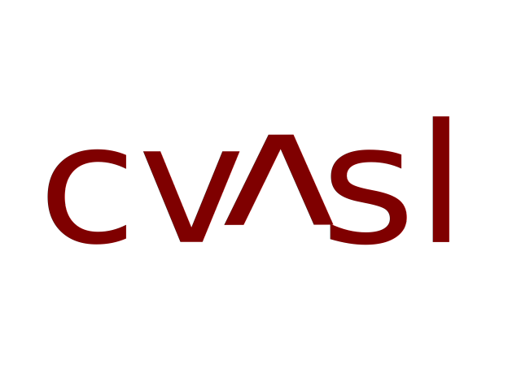

<p align="center">
    
</p>

[](https://zenodo.org/badge/latestdoi/618300539)
[](https://pypi.python.org/pypi/cvasl/)
[](https://anaconda.org/brainspinner-org/cvasl/badges/version.svg)
[](https://github.com/brainspinner/cvasl/actions/workflows/on-commit.yml)
[](https://github.com/brainspinner/cvasl/actions/workflows/on-tag.yml)

**cvasl** is an open source collaborative python library for analysis
of brain MRIs. Many functions relate to arterial spin labeled sequences.


This library
supports the ongoing research at University of Amsterdam Medical Center on brain ageing, but
is being buit for the entire community of radiology researchers across all university and academic medical centers and beyond.


### Supported Platforms

cvasl is not a pure Python package. If
you want to run all possibilities you will need R, and therefore the conda version.
The current conda version release v0.0.4 has the limitation that it is missing the `nipy`
and `k-means-constrained` python libraries.
We are  working to update this, but the user should add these to their environment.
Below is the list of platforms that should work in terms of the Python code.
Other platforms may work, but have had less extensive testing.
Please note that where
python.org Python or Anaconda Python stated as supported, it means
that versions 3.10 and above are supported.

#### AMD64 (x86)

|                             | Linux     | Win       | OSX       |
|:---------------------------:|:---------:|:---------:|:---------:|
|    | Supported | Unknown   | Unknown   |
|  | Supported | Supported | Supported |

### Program files

The main program in this repository (made of the modules in the cvasl folder) contains functions for analysis of MRIs.

### Folders and Notebooks

To look around keep in mind the following distinction on folders:

researcher_interface:
- This folder will be added in the future for
  a growing series of interactive notebooks that allow
  researchers to investigate questions about their own MRI data

open_work:
- This folder contains experimental work by core members of the cvasl
  team (including Dr. Candace Makeda Moore, Dr. Dani Bodor, Dr. Henk Mutsaerts)

harmonization_paper:
- This folder contains experimental work for a forthcoming paper by core members of the cvasl
  team (including Dr. Candace Makeda Moore, Dr. Dani Bodor, Dr. Henk Mutsaerts,
  and Mathijs Dijsselhof) which deals with radiological image harmonization.

lab_datasets:
- This folder contains notebooks which show how image datasets were assembled in notebooks.

Please keep in mind that at present you will only be able to scroll images
in the notebooks with a browser based approach i.e. run Jupyter in a browser but
not in VSCode or another IDE to scroll the brain MRIs.


### Data sets

The notebooks are configured to run on various datasets.  Contact
Dr. Candace Makeda Moore( 📫 c.moore@esciencecenter.nl) to discuss any
questions on data configuration for your datasets. In terms of
derived value datasets (which use measurements instead of images)
You will need tsv and/or csv file
datasets arranged in a particular format as specified in
[seperated_values_specifications.md](seperated_values_specifications.md)
If you plan to make pull requests to the library or use it to show your work
you should take care not to use tabular data in such a way as patient identifying data
is revealed.


### Configuring (to work with your data)

In order to preprocess and/or to train  models the code needs to be
able to locate the raw data you want it to work with.

There are several ways to specify the location of the following
directories:

-   **bids:** Special directory.  The rest of the directory layout can
    be derived from its location.

You can store this information persistently in several locations.

1.  In the same directory where you run the script (or the notebook).
    e.g. `./config.json`.
2.  In home directory, e.g. `~/.cvasl/config.json`.
3.  In global directory, e.g. `/etc/cvasl/config.json`.

However, we highly recommend you use the home directory.
This file can have this or similar contents:

    {

        "bids": "/mnt/source_data",
        "raw_data": "/mnt/source_data/raw_data",
        "derivatives": "/mnt/source_data/derivates/",
        "explore_asl": "/mnt/source_data/derivates/explore_asl",
        "cvage": "/mnt/source_data/derivates/cvage",
        "cvage_inputs": "/mnt/source_data/derivates/cvage/cvage_inputs",
        "cvage_outputs": "/mnt/source_data/derivates/cvage/cvage_outputs",

    }

The file is read as follows: if the file only specifies `bids`
directory, then the derivative missing entries are assumed to be
relative to the root in a BIDS compliant format order You don't need
to specify all entries.  If you do, you can overwrite the ALS-BIDS
format order but this is not reccomended.

When working from command line, it may be useful to experiment with
different directory layouts or to quickly override the existing
options.  To do so, you can invoke the program like this:

```sh
python -m cvasl -C raw_data:/path/to/data <other options>
content_copy
download
Use code with caution.
Markdown

The snippet above allows using existing config.json but overrides
the location of raw_data directory.

python -m cvasl -C bids:/path/to/data -n <other options>
content_copy
download
Use code with caution.
Sh

The snippet above ignores any existing config.json files and sets
the BIDS directory to /path/to/data (the rest will be derived from
it).

python -m cvasl \
    -C raw_data:/path/to/data \
    -C derivatives:/path/to/derivatives \
    -c /custom/config/location \
    <other options>
content_copy
download
Use code with caution.
Sh

The snippet above looks for configuration file in the alternative
location: /custom/config/location while overriding the locations of
raw_data aand of derivatives directories.

If you aren't sure where the data would be read or stored, you can run:

python -m cvasl <some options> dump_config
content_copy
download
Use code with caution.
Sh

The above will print the effective configuration that will be used by
the program.

Test data

You can get test data by contacting the cvage team. Please email Dr. Moore at c.moore@esciencecenter.nl

Getting started

How to get the notebooks running? Assuming the raw data set and
metadata is available.

Assuming you are using conda for package management:

Make sure you are in no environment:

conda deactivate
content_copy
download
Use code with caution.
Sh

(optional repeat if you are in the base environment)

You should be in no environment or the base environment now

Option A: Fastest option:
In a base-like environment with mamba installed, you can install all Python packages required, using mamba and the environment.yml file.

If you do not have mamba installed you can follow instructions (here)[https://anaconda.org/conda-forge/mamba]

The command for Windows/Anaconda/Mamba users can be something like:

mamba env create -f environment.yml
content_copy
download
Use code with caution.
Sh

Option B: To work with the most current versions with the possibility for development:
Install all Python packages required, using conda and the environment.yml file.

The command for Windows/Anaconda users can be something like:

conda env create -f environment.yml
content_copy
download
Use code with caution.
Sh

Currently, you will then need to clone the repository to run the cvasl from repo.
We will soon have an option to create the entire environment at once from conda.

Option C:
* Linux users can create their own environment by hand (use
  install_dev as in setup).
content_copy
download
Use code with caution.

If you want to work with command-line, you can do so in your terminal, but
if you would like to run our pre-made notebooks, then you can start them by entering
jupyter lab into the terminal

Documentation:

You can look at our online documentation or build it by hand
(see the setup file, the workflows, and it may be clear)

Testing

The testing framework is pytest. If you wish to run
automated testing of the notebooks then you must run it in the dedicated testing environment
mriland which can be built from the test_environment.yml file. All other testing and automated testing
can be run in the regular environment.
The project doesn't include complete testing data yet.

Command-Line Interface

You can preprocess, train and use models, and perform harmonization using the command-line interface.

MRIdataset Class

The MRIdataset class in cvasl.dataset is designed to load and preprocess MRI datasets for harmonization and analysis. It supports loading data from CSV files, preprocessing steps like feature dropping, categorical encoding, and adding derived features (ICV, decade).

MRIdataset Initialization Parameters:

path (str or list): Path to the CSV file or a list of paths for datasets spanning multiple files (e.g., for datasets like TOPMRI which might be spread across 'TOP_input.csv' and 'StrokeMRI_input.csv').

site_id (int or str): Identifier for the data acquisition site. This is crucial for harmonization to distinguish between datasets from different sites.

patient_identifier (str, optional): Column name that uniquely identifies each patient. Defaults to "participant_id".

features_to_drop (list, optional): List of feature names (columns) to be dropped from the dataset during preprocessing. Defaults to ["m0", "id"].

cat_features_to_encode (list, optional): List of categorical feature names to be encoded into numerical representations. This is important for harmonizers and models that require numerical input. Defaults to None.

ICV (bool, optional): If True, adds Intracranial Volume (ICV) related features, assuming 'gm_vol' and 'gm_icvratio' columns are available. Defaults to False.

decade (bool, optional): If True, adds a 'decade' feature derived from the 'age' column. Defaults to False.

features_to_bin (list, optional): List of features to be binned. Defaults to None.

binning_method (str, optional): Method for binning, either "equal_width" or "equal_frequency". Defaults to "equal_width".

num_bins (int, optional): Number of bins to create for binning. Defaults to 10.

bin_labels (list, optional): Custom labels for the bins. Defaults to None.

Example of creating MRIdataset objects in runharmonize.py:

Edis_path = '../data/EDIS_input.csv'
helius_path = '../data/HELIUS_input.csv'
sabre_path = '../data/SABRE_input.csv'
insight_path = '../data/Insight46_input.csv'
topmri_path = ['../data/TOP_input.csv','../data/StrokeMRI_input.csv']

features_to_drop = ["m0", "id"]
features_to_map = ['readout', 'labelling', 'sex']
patient_identifier = 'participant_id'

edis = MRIdataset(Edis_path, site_id=0, decade=True, ICV = True, patient_identifier=patient_identifier, features_to_drop=features_to_drop)
helius = MRIdataset(helius_path, site_id=1, decade=True, ICV = True, patient_identifier=patient_identifier, features_to_drop=features_to_drop)
sabre = MRIdataset(sabre_path, site_id=2, decade=True, ICV = True, patient_identifier=patient_identifier, features_to_drop=features_to_drop)
topmri = MRIdataset(topmri_path, site_id=3, decade=True, ICV = True, patient_identifier=patient_identifier, features_to_drop=features_to_drop)
insight46 = MRIdataset(insight_path, site_id=4, decade=True, ICV = True, patient_identifier=patient_identifier, features_to_drop=features_to_drop)

datasets = [edis, helius, sabre, topmri, insight46]
[_d.preprocess() for _d in datasets] # Preprocess all datasets
datasets = encode_cat_features(datasets,features_to_map) # Encode categorical features across datasets
content_copy
download
Use code with caution.
Python
Harmonization Methods

The cvasl.harmonizers module provides several harmonization techniques to reduce site-specific variance in MRI data. Below is a guide to the available harmonizers and how to run them via the command-line interface using harmonizer_cli.py.

Running Harmonization via CLI

To run harmonization, use the harmonizer_cli.py script with the following general command structure:

python harmonizer_cli.py --dataset_paths <dataset_paths> --site_ids <site_ids> --method <harmonization_method> [harmonizer_specific_options] [dataset_options]
content_copy
download
Use code with caution.
Bash

--dataset_paths: Comma-separated paths to your dataset CSV files. For datasets with multiple input paths (like TOPMRI), use semicolons to separate paths within a dataset entry, and commas to separate different datasets (e.g., path1,path2,"path3;path4",path5).

--site_ids: Comma-separated site IDs corresponding to each dataset path provided in --dataset_paths.

--method: The name of the harmonization method to be used. Available methods are: neuroharmonize, covbat, neurocombat, nestedcombat, comscanneuroharmonize, autocombat, relief, combat++.

[harmonizer_specific_options]: Placeholders for parameters specific to each harmonization method. These are detailed below for each harmonizer.

[dataset_options]: Options related to dataset loading and preprocessing, such as --patient_identifier, --features_to_drop, --features_to_map, --decade, --icv. These options are common across all harmonizers.

Harmonization Methods and Example Commands:

Below are example commands for each harmonization method. Adjust dataset paths and parameters as needed for your data.

NeuroHarmonize:

python harmonizer_cli.py --dataset_paths ../data/EDIS_input.csv,../data/HELIUS_input.csv,../data/SABRE_input.csv,"../data/TOP_input.csv;../data/StrokeMRI_input.csv",../data/Insight46_input.csv --site_ids 0,1,2,3,4 --method neuroharmonize --patient_identifier participant_id --features_to_drop m0,id --features_to_map readout,labelling,sex --decade True --icv True --nh_features_to_harmonize aca_b_cov,mca_b_cov,pca_b_cov,totalgm_b_cov,aca_b_cbf,mca_b_cbf,pca_b_cbf,totalgm_b_cbf --nh_covariates age,sex,icv,site --nh_site_indicator site
content_copy
download
Use code with caution.
Bash

Covbat:

python harmonizer_cli.py --dataset_paths ../data/EDIS_input.csv,../data/HELIUS_input.csv,../data/SABRE_input.csv,"../data/TOP_input.csv;../data/StrokeMRI_input.csv",../data/Insight46_input.csv --site_ids 0,1,2,3,4 --method covbat --patient_identifier participant_id --features_to_drop m0,id --features_to_map readout,labelling,sex --decade True --icv True --cb_features_to_harmonize participant_id,site,age,sex,site,aca_b_cov,mca_b_cov,pca_b_cov,totalgm_b_cov,aca_b_cbf,mca_b_cbf,pca_b_cbf,totalgm_b_cbf --cb_covariates age,sex --cb_numerical_covariates age --cb_site_indicator site
content_copy
download
Use code with caution.
Bash

NeuroCombat:

python harmonizer_cli.py --dataset_paths ../data/EDIS_input.csv,../data/HELIUS_input.csv,../data/SABRE_input.csv,"../data/TOP_input.csv;../data/StrokeMRI_input.csv",../data/Insight46_input.csv --site_ids 0,1,2,3,4 --method neurocombat --patient_identifier participant_id --features_to_drop m0,id --features_to_map readout,labelling,sex --decade True --icv True --nc_features_to_harmonize ACA_B_CoV,MCA_B_CoV,PCA_B_CoV,TotalGM_B_CoV,ACA_B_CBF,MCA_B_CBF,PCA_B_CBF,TotalGM_B_CBF --nc_discrete_covariates sex --nc_continuous_covariates age --nc_site_indicator site
content_copy
download
Use code with caution.
Bash

NestedComBat:

python harmonizer_cli.py --dataset_paths ../data/EDIS_input.csv,../data/HELIUS_input.csv,../data/SABRE_input.csv,"../data/TOP_input.csv;../data/StrokeMRI_input.csv",../data/Insight46_input.csv --site_ids 0,1,2,3,4 --method nestedcombat --patient_identifier participant_id --features_to_drop m0,id --features_to_map readout,labelling,sex --decade True --icv True --nest_features_to_harmonize ACA_B_CoV,MCA_B_CoV,PCA_B_CoV,TotalGM_B_CoV,ACA_B_CBF,MCA_B_CBF,PCA_B_CBF,TotalGM_B_CBF --nest_batch_list_harmonisations readout,ld,pld --nest_site_indicator site --nest_discrete_covariates sex --nest_continuous_covariates age --nest_use_gmm False
content_copy
download
Use code with caution.
Bash

Combat++:

python harmonizer_cli.py --dataset_paths ../data/EDIS_input.csv,../data/HELIUS_input.csv,../data/SABRE_input.csv,"../data/TOP_input.csv;../data/StrokeMRI_input.csv",../data/Insight46_input.csv --site_ids 0,1,2,3,4 --method combat++ --patient_identifier participant_id --features_to_drop m0,id --features_to_map readout,labelling,sex --decade True --icv True --compp_features_to_harmonize aca_b_cov,mca_b_cov,pca_b_cov,totalgm_b_cov,aca_b_cbf,mca_b_cbf,pca_b_cbf,totalgm_b_cbf --compp_discrete_covariates sex --compp_continuous_covariates age --compp_discrete_covariates_to_remove labelling --compp_continuous_covariates_to_remove ld --compp_site_indicator site
content_copy
download
Use code with caution.
Bash

ComscanNeuroHarmonize:

python harmonizer_cli.py --dataset_paths ../data/EDIS_input.csv,../data/HELIUS_input.csv,../data/SABRE_input.csv,"../data/TOP_input.csv;../data/StrokeMRI_input.csv",../data/Insight46_input.csv --site_ids 0,1,2,3,4 --method comscanneuroharmonize --patient_identifier participant_id --features_to_drop m0,id --features_to_map readout,labelling,sex --decade True --icv True --csnh_features_to_harmonize aca_b_cov,mca_b_cov,pca_b_cov,totalgm_b_cov,aca_b_cbf,mca_b_cbf,pca_b_cbf,totalgm_b_cbf --csnh_discrete_covariates sex --csnh_continuous_covariates decade --csnh_site_indicator site
content_copy
download
Use code with caution.
Bash

AutoComBat:

python harmonizer_cli.py --dataset_paths ../data/EDIS_input.csv,../data/HELIUS_input.csv,../data/SABRE_input.csv,"../data/TOP_input.csv;../data/StrokeMRI_input.csv",../data/Insight46_input.csv --site_ids 0,1,2,3,4 --method autocombat --patient_identifier participant_id --features_to_drop m0,id --features_to_map readout,labelling,sex --decade True --icv True --ac_features_to_harmonize aca_b_cov,mca_b_cov,pca_b_cov,totalgm_b_cov,aca_b_cbf,mca_b_cbf,pca_b_cbf,totalgm_b_cbf --ac_data_subset aca_b_cov,mca_b_cov,pca_b_cov,totalgm_b_cov,aca_b_cbf,mca_b_cbf,pca_b_cbf,totalgm_b_cbf,site,readout,labelling,pld,ld,sex,age --ac_discrete_covariates sex --ac_continuous_covariates age --ac_site_indicator site,readout,pld,ld --ac_discrete_cluster_features site,readout --ac_continuous_cluster_features pld,ld
content_copy
download
Use code with caution.
Bash

RELIEF:

python harmonizer_cli.py --dataset_paths ../data/EDIS_input.csv,../data/HELIUS_input.csv,../data/SABRE_input.csv,"../data/TOP_input.csv;../data/StrokeMRI_input.csv",../data/Insight46_input.csv --site_ids 0,1,2,3,4 --method relief --patient_identifier participant_id --features_to_drop m0,id --features_to_map readout,labelling,sex --decade True --icv True --relief_features_to_harmonize aca_b_cov,mca_b_cov,pca_b_cov,totalgm_b_cov,aca_b_cbf,mca_b_cbf,pca_b_cbf,totalgm_b_cbf --relief_covariates sex,age --relief_patient_identifier participant_id
content_copy
download
Use code with caution.
Bash

Important Notes:

Adjust Paths: Ensure that you replace placeholder paths (e.g., ../data/EDIS_input.csv) with the actual paths to your data files.

Parameter Tuning: The provided commands use example parameters. You may need to adjust harmonization parameters (features to harmonize, covariates, etc.) based on your dataset and harmonization goals. Consult the documentation or code comments for each harmonizer to understand specific parameter options.

R Requirement: Methods like RELIEF and Combat++ require R to be installed and accessible in your environment, along with the necessary R packages (denoiseR, RcppCNPy, matrixStats).

Output Files: Harmonized datasets will be saved as new CSV files in the same directory as your input datasets, with filenames appended with output_<harmonization_method>.

By following these guidelines, you can effectively utilize the harmonization functionalities within cvasl to process your MRI datasets and mitigate site-related biases.

## Harmonization Guide

This section provides a guide on using the `cvasl` library for MRI data harmonization. It covers the `MRIdataset` class for data loading and preprocessing, and various harmonization methods available in the `cvasl.harmonizers` module.

### MRIdataset Class

The `MRIdataset` class in `cvasl.dataset` is designed to handle MRI datasets from different sites, preparing them for harmonization and analysis.

**Initialization Parameters:**

*   `path` (str or list): Path to the CSV file or a list of paths. For multiple paths, use a list of strings.
*   `site_id` (int or str): Identifier for the data acquisition site.
*   `patient_identifier` (str, optional): Column name for patient IDs. Defaults to `"participant_id"`.
*   `cat_features_to_encode` (list, optional): List of categorical features to encode. Defaults to `None`.
*   `ICV` (bool, optional): Whether to add Intracranial Volume (ICV) related features. Defaults to `False`.
*   `decade` (bool, optional): Whether to add decade-related features based on age. Defaults to `False`.
*   `features_to_drop` (list, optional): List of features to drop during preprocessing. Defaults to `["m0", "id"]`.
*   `features_to_bin` (list, optional): List of features to bin. Defaults to `None`.
*   `binning_method` (str, optional): Binning method to use; `"equal_width"` or `"equal_frequency"`. Defaults to `"equal_width"`.
*   `num_bins` (int, optional): Number of bins for binning. Defaults to `10`.
*   `bin_labels` (list, optional): Labels for bins. Defaults to `None`.

**Usage Example:**

```python
from cvasl.dataset import MRIdataset

edis = MRIdataset(path='../data/EDIS_input.csv', site_id=0, decade=True, ICV=True, patient_identifier='participant_id', features_to_drop=["m0", "id"])
helius = MRIdataset(path='../data/HELIUS_input.csv', site_id=1, decade=True, ICV=True, patient_identifier='participant_id', features_to_drop=["m0", "id"])
topmri = MRIdataset(path=['../data/TOP_input.csv','../data/StrokeMRI_input.csv'], site_id=3, decade=True, ICV=True, patient_identifier='participant_id', features_to_drop=["m0", "id"])
```

**Preprocessing:**

After initializing `MRIdataset` objects, you can preprocess them using the `preprocess()` method:

```python
datasets = [edis, helius, topmri] # Example list of MRIdataset objects
[_d.preprocess() for _d in datasets]
```

**Categorical Feature Encoding:**

For categorical feature encoding across datasets, use the `encode_cat_features` function:

```python
from cvasl.dataset import encode_cat_features

features_to_map = ['readout', 'labelling', 'sex']
datasets = encode_cat_features(datasets, features_to_map)
```

### Harmonization Methods

The `cvasl.harmonizers` module provides several state-of-the-art harmonization methods. Below is a guide to each method and how to run them using the command-line interface (CLI).

**Running Harmonization via CLI:**

The `harmonizer_cli.py` script in `cvasl` allows you to run various harmonization methods from the command line. You need to specify the dataset paths, site IDs, harmonization method, and method-specific parameters.

**General CLI Usage:**

```bash
python harmonizer_cli.py --dataset_paths <dataset_path1>,<dataset_path2>,... --site_ids <site_id1>,<site_id2>,... --method <harmonization_method> [method_specific_options]
```

**Available Harmonization Methods and CLI Commands:**

1.  **NeuroHarmonize:**

    *   Method Class: `NeuroHarmonize`
    *   CLI `--method` value: `neuroharmonize`
    *   Method-specific CLI Options:
        *   `--nh_features_to_harmonize`: Features to harmonize (comma-separated).
        *   `--nh_covariates`: Covariates (comma-separated).
        *   `--nh_smooth_terms`: Smooth terms (comma-separated, optional).
        *   `--nh_site_indicator`: Site indicator column name.
        *   `--nh_empirical_bayes`: Use empirical Bayes (True/False).

    *   **Example Command:**

        ```bash
        python harmonizer_cli.py --dataset_paths ../data/EDIS_input.csv,../data/HELIUS_input.csv,../data/SABRE_input.csv,"../data/TOP_input.csv;../data/StrokeMRI_input.csv",../data/Insight46_input.csv --site_ids 0,1,2,3,4 --method neuroharmonize --patient_identifier participant_id --features_to_drop m0,id --features_to_map readout,labelling,sex --decade True --icv True --nh_features_to_harmonize aca_b_cov,mca_b_cov,pca_b_cov,totalgm_b_cov,aca_b_cbf,mca_b_cbf,pca_b_cbf,totalgm_b_cbf --nh_covariates age,sex,icv,site --nh_site_indicator site
        ```

2.  **Covbat:**

    *   Method Class: `Covbat`
    *   CLI `--method` value: `covbat`
    *   Method-specific CLI Options:
        *   `--cb_features_to_harmonize`: Features to harmonize (comma-separated).
        *   `--cb_covariates`: Covariates (comma-separated).
        *   `--cb_site_indicator`: Site indicator column name.
        *   `--cb_patient_identifier`: Patient identifier column name.
        *   `--cb_numerical_covariates`: Numerical covariates (comma-separated).
        *   `--cb_empirical_bayes`: Use empirical Bayes (True/False).

    *   **Example Command:**

        ```bash
        python harmonizer_cli.py --dataset_paths ../data/EDIS_input.csv,../data/HELIUS_input.csv,../data/SABRE_input.csv,"../data/TOP_input.csv;../data/StrokeMRI_input.csv",../data/Insight46_input.csv --site_ids 0,1,2,3,4 --method covbat --patient_identifier participant_id --features_to_drop m0,id --features_to_map readout,labelling,sex --decade True --icv True --cb_features_to_harmonize participant_id,site,age,sex,site,aca_b_cov,mca_b_cov,pca_b_cov,totalgm_b_cov,aca_b_cbf,mca_b_cbf,pca_b_cbf,totalgm_b_cbf --cb_covariates age,sex --cb_numerical_covariates age --cb_site_indicator site
        ```

3.  **NeuroCombat:**

    *   Method Class: `NeuroCombat`
    *   CLI `--method` value: `neurocombat`
    *   Method-specific CLI Options:
        *   `--nc_features_to_harmonize`: Features to harmonize (comma-separated).
        *   `--nc_discrete_covariates`: Discrete covariates (comma-separated).
        *   `--nc_continuous_covariates`: Continuous covariates (comma-separated).
        *   `--nc_site_indicator`: Site indicator column name.
        *   `--nc_patient_identifier`: Patient identifier column name.
        *   `--nc_empirical_bayes`: Use empirical Bayes (True/False).
        *   `--nc_mean_only`: Mean-only adjustment (True/False).
        *   `--nc_parametric`: Parametric adjustment (True/False).

    *   **Example Command:**

        ```bash
        python harmonizer_cli.py --dataset_paths ../data/EDIS_input.csv,../data/HELIUS_input.csv,../data/SABRE_input.csv,"../data/TOP_input.csv;../data/StrokeMRI_input.csv",../data/Insight46_input.csv --site_ids 0,1,2,3,4 --method neurocombat --patient_identifier participant_id --features_to_drop m0,id --features_to_map readout,labelling,sex --decade True --icv True --nc_features_to_harmonize ACA_B_CoV,MCA_B_CoV,PCA_B_CoV,TotalGM_B_CoV,ACA_B_CBF,MCA_B_CBF,PCA_B_CBF,TotalGM_B_CBF --nc_discrete_covariates sex --nc_continuous_covariates age --nc_site_indicator site
        ```

4.  **NestedComBat:**

    *   Method Class: `NestedComBat`
    *   CLI `--method` value: `nestedcombat`
    *   Method-specific CLI Options:
        *   `--nest_features_to_harmonize`: Features to harmonize (comma-separated).
        *   `--nest_batch_list_harmonisations`: Batch variables for nested ComBat (comma-separated).
        *   `--nest_site_indicator`: Site indicator column name.
        *   `--nest_discrete_covariates`: Discrete covariates (comma-separated).
        *   `--nest_continuous_covariates`: Continuous covariates (comma-separated).
        *   `--nest_intermediate_results_path`: Path for intermediate results.
        *   `--nest_patient_identifier`: Patient identifier column name.
        *   `--nest_return_extended`: Return extended outputs (True/False).
        *   `--nest_use_gmm`: Use Gaussian Mixture Model (True/False).

    *   **Example Command:**

        ```bash
        python harmonizer_cli.py --dataset_paths ../data/EDIS_input.csv,../data/HELIUS_input.csv,../data/SABRE_input.csv,"../data/TOP_input.csv;../data/StrokeMRI_input.csv",../data/Insight46_input.csv --site_ids 0,1,2,3,4 --method nestedcombat --patient_identifier participant_id --features_to_drop m0,id --features_to_map readout,labelling,sex --decade True --icv True --nest_features_to_harmonize ACA_B_CoV,MCA_B_CoV,PCA_B_CoV,TotalGM_B_CoV,ACA_B_CBF,MCA_B_CBF,PCA_B_CBF,TotalGM_B_CBF --nest_batch_list_harmonisations readout,ld,pld --nest_site_indicator site --nest_discrete_covariates sex --nest_continuous_covariates age --nest_use_gmm False
        ```

5.  **Combat++:**

    *   Method Class: `CombatPlusPlus`
    *   CLI `--method` value: `combat++`
    *   Method-specific CLI Options:
        *   `--compp_features_to_harmonize`: Features to harmonize (comma-separated).
        *   `--compp_discrete_covariates`: Discrete covariates (comma-separated).
        *   `--compp_continuous_covariates`: Continuous covariates (comma-separated).
        *   `--compp_discrete_covariates_to_remove`: Discrete covariates to remove (comma-separated).
        *   `--compp_continuous_covariates_to_remove`: Continuous covariates to remove (comma-separated).
        *   `--compp_site_indicator`: Site indicator column name.
        *   `--compp_patient_identifier`: Patient identifier column name.
        *   `--compp_intermediate_results_path`: Path for intermediate results.

    *   **Example Command:**

        ```bash
        python harmonizer_cli.py --dataset_paths ../data/EDIS_input.csv,../data/HELIUS_input.csv,../data/SABRE_input.csv,"../data/TOP_input.csv;../data/StrokeMRI_input.csv",../data/Insight46_input.csv --site_ids 0,1,2,3,4 --method combat++ --patient_identifier participant_id --features_to_drop m0,id --features_to_map readout,labelling,sex --decade True --icv True --compp_features_to_harmonize aca_b_cov,mca_b_cov,pca_b_cov,totalgm_b_cov,aca_b_cbf,mca_b_cbf,pca_b_cbf,totalgm_b_cbf --compp_discrete_covariates sex --compp_continuous_covariates age --compp_discrete_covariates_to_remove labelling --compp_continuous_covariates_to_remove ld --compp_site_indicator site
        ```

6.  **ComscanNeuroHarmonize:**

    *   Method Class: `ComscanNeuroCombat`
    *   CLI `--method` value: `comscanneuroharmonize`
    *   Method-specific CLI Options:
        *   `--csnh_features_to_harmonize`: Features to harmonize (comma-separated).
        *   `--csnh_discrete_covariates`: Discrete covariates (comma-separated).
        *   `--csnh_continuous_covariates`: Continuous covariates (comma-separated).
        *   `--csnh_site_indicator`: Site indicator column name.

    *   **Example Command:**

        ```bash
        python harmonizer_cli.py --dataset_paths ../data/EDIS_input.csv,../data/HELIUS_input.csv,../data/SABRE_input.csv,"../data/TOP_input.csv;../data/StrokeMRI_input.csv",../data/Insight46_input.csv --site_ids 0,1,2,3,4 --method comscanneuroharmonize --patient_identifier participant_id --features_to_drop m0,id --features_to_map readout,labelling,sex --decade True --icv True --csnh_features_to_harmonize aca_b_cov,mca_b_cov,pca_b_cov,totalgm_b_cov,aca_b_cbf,mca_b_cbf,pca_b_cbf,totalgm_b_cbf --csnh_discrete_covariates sex --csnh_continuous_covariates decade --csnh_site_indicator site
        ```

7.  **AutoComBat:**

    *   Method Class: `AutoCombat`
    *   CLI `--method` value: `autocombat`
    *   Method-specific CLI Options:
        *   `--ac_features_to_harmonize`: Features to harmonize (comma-separated).
        *   `--ac_data_subset`: Data subset features (comma-separated).
        *   `--ac_discrete_covariates`: Discrete covariates (comma-separated).
        *   `--ac_continuous_covariates`: Continuous covariates (comma-separated).
        *   `--ac_site_indicator`: Site indicator column name(s), comma-separated if multiple.
        *   `--ac_discrete_cluster_features`: Discrete cluster features (comma-separated).
        *   `--ac_continuous_cluster_features`: Continuous cluster features (comma-separated).
        *   `--ac_metric`: Metric for cluster optimization (`distortion`, `silhouette`, `calinski_harabasz`).
        *   `--ac_features_reduction`: Feature reduction method (`pca`, `umap`, `None`).
        *   `--ac_feature_reduction_dimensions`: Feature reduction dimensions (int).
        *   `--ac_empirical_bayes`: Use empirical Bayes (True/False).

    *   **Example Command:**

        ```bash
        python harmonizer_cli.py --dataset_paths ../data/EDIS_input.csv,../data/HELIUS_input.csv,../data/SABRE_input.csv,"../data/TOP_input.csv;../data/StrokeMRI_input.csv",../data/Insight46_input.csv --site_ids 0,1,2,3,4 --method autocombat --patient_identifier participant_id --features_to_drop m0,id --features_to_map readout,labelling,sex --decade True --icv True --ac_features_to_harmonize aca_b_cov,mca_b_cov,pca_b_cov,totalgm_b_cov,aca_b_cbf,mca_b_cbf,pca_b_cbf,totalgm_b_cbf --ac_data_subset aca_b_cov,mca_b_cov,pca_b_cov,totalgm_b_cov,aca_b_cbf,mca_b_cbf,pca_b_cbf,totalgm_b_cbf,site,readout,labelling,pld,ld,sex,age --ac_discrete_covariates sex --ac_continuous_covariates age --ac_site_indicator site,readout,pld,ld --ac_discrete_cluster_features site,readout --ac_continuous_cluster_features pld,ld
        ```

8.  **RELIEF:**

    *   Method Class: `RELIEF`
    *   CLI `--method` value: `relief`
    *   Method-specific CLI Options:
        *   `--relief_features_to_harmonize`: Features to harmonize (comma-separated).
        *   `--relief_covariates`: Covariates (comma-separated).
        *   `--relief_patient_identifier`: Patient identifier column name.
        *   `--relief_intermediate_results_path`: Path for intermediate results.

    *   **Example Command:**

        ```bash
        python harmonizer_cli.py --dataset_paths ../data/EDIS_input.csv,../data/HELIUS_input.csv,../data/SABRE_input.csv,"../data/TOP_input.csv;../data/StrokeMRI_input.csv",../data/Insight46_input.csv --site_ids 0,1,2,3,4 --method relief --patient_identifier participant_id --features_to_drop m0,id --features_to_map readout,labelling,sex --decade True --icv True --relief_features_to_harmonize aca_b_cov,mca_b_cov,pca_b_cov,totalgm_b_cov,aca_b_cbf,mca_b_cbf,pca_b_cbf,totalgm_b_cbf --relief_covariates sex,age --relief_patient_identifier participant_id
        ```

**Note:**  For datasets with multiple paths (like TOPMRI in the examples), use semicolons (`;`) to separate paths within the `--dataset_paths` argument, while using commas (`,`) to separate different datasets.

✨Copyright 2023 Netherlands eScience Center and U. Amsterdam Medical Center
Licensed under <TBA> See LICENSE for details.✨